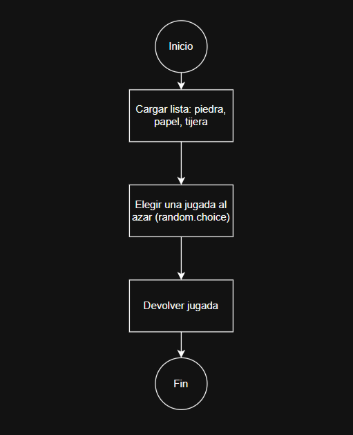
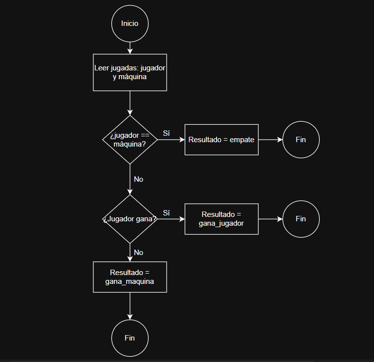
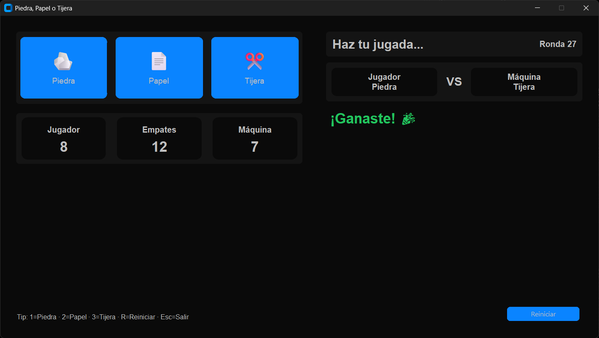

# 🪨✂️📄 Piedra–Papel–Tijera (Python)


---

## 🎯 Objetivo
Simular el juego *Piedra–Papel–Tijera*. El jugador elige su jugada, la máquina elige al azar y el sistema decide el resultado. Permite jugar múltiples rondas, muestra un **marcador** y ofrece una **interfaz gráfica** con tema oscuro usando CustomTkinter.

---

## 🧱 Arquitectura por capas
- **UI (CustomTkinter)** → botones (piedra/papel/tijera), panel VS, resultado y marcador.
- **Core** → reglas + **orquestación** de una ronda (`jugar_ronda`): llama al RNG, decide el resultado y actualiza el marcador.
- **RNG** → genera la jugada de la máquina con distribución uniforme.
- **Marcador (Estado)** → variables en memoria: `puntosJugador`, `puntosMaquina`, `empates` + funciones `sumarJugador`, `sumarMaquina`, `sumarEmpate`, `getMarcador`, `reset`.

---

## 📦 Estructura del repo
```
/diagramas/
  diagramaflujocore.png
  diagramaflujorng.png
/recursos/
  tema.json               # tema con los colores para la UI
  piedra.png, papel.png, tijera.png
core.py                   # reglas + orquestación
rng.py                    # jugada aleatoria de la CPU
marcador.py               # estado del marcador
ui.py                     # interfaz gráfica 
main.py                   # punto de entrada 
demo_cli.py               # demo por consola 
check_uniformidad.py      # verificación simple del RNG 
README.md
```

---

## 🧰 Requisitos
- Python 3.x
- Dependencias: `customtkinter`, `pillow`
---

## 🧪 Crear y usar entorno virtual (venv)
### Windows (PowerShell)
```powershell
# 1) Crear venv
python -m venv .venv
# 2) Activar
.venv\Scripts\Activate.ps1
# 3) Instlalar dependencias
pip install -r requirements.txt 
# 4) Ejecutar la app
python main.py
```

### macOS / Linux 
```bash
# 1) Crear venv
python3 -m venv .venv
# 2) Activar
source .venv/bin/activate
# 3) Instalar dependencias
pip install -r requirements.txt 
# 4) Ejecutar la app
python main.py
```
> Para salir del entorno virtual: `deactivate`
---

## ▶️ Cómo ejecutar
### Interfaz gráfica
```bash
python main.py
```
- **Atajos:** `1`=Piedra, `2`=Papel, `3`=Tijera, `R`=Reset, `Esc`=Salir.

### En terminal 
```bash
python demo_cli.py
```

### Verificación simple del RNG
```bash
python check_uniformidad.py
```

---

## ⚙️ Principales módulos
- **`rng.py`** — `jugada_maquina()` devuelve `"piedra"|"papel"|"tijera"` con probabilidad similar.
- **`core.py`**
  - `resolver_resultado(jugador, maquina)` → `"gana_jugador"|"gana_maquina"|"empate"`.
  - `jugar_ronda(jugada_jugador)` → orquesta la ronda: llama RNG, decide y actualiza el marcador; retorna `(resultado, jugada_maquina)`.
- **`marcador.py`** — estado del juego en memoria; funciones `sumarJugador`, `sumarMaquina`, `sumarEmpate`, `getMarcador`, `reset`.
- **`ui.py`** — interfaz CustomTkinter (dos paneles, resultado con color, tarjetas del marcador).
- **`main.py`** — punto de entrada: crea `PPTApp()` y llama a `app.mainloop()`.

---

## 📚 Integración de contenidos (Unidades 1–4)

### ✅ UNIDAD 1 — Introducción a la Resolución de Problemas y al Entorno de Programación
- Planteamiento del problema (PPT) y descomposición en subcomponentes.
- Configuración básica del entorno, ejecución de scripts y estructura mínima del proyecto.

### ✅ UNIDAD 1 — Entorno de Programación
- Organización del repositorio, uso de *venv* y `requirements.txt`.
- Ejecución del punto de entrada `main.py` y ciclo de vida de la app.

### ✅ UNIDAD 2 — Manejo de Datos, Algoritmos y Diagramas de Flujo
- **Almacenamiento de datos. Variables. Tipos de datos.**  
  Cadenas para jugadas; enteros para el marcador.
- **Operadores y prioridad.**  
  Operadores lógicos/relacionales en `resolver_resultado`.
- **Algoritmos y Diagramas de Flujo (Semana 4).**  
  Diagrama de actividad y flujos de RNG/Core (carpeta `/diagramas`).

### ✅ UNIDAD 3 — Condicionales
- `if / elif / else` para decidir ganadores y mensajes.
- Validación de entradas en la demo por consola con `continue`.

### ✅ UNIDAD 4 — Estructuras de Datos
- **Tuplas**: tamaños y retornos inmutables simples (p. ej., `(resultado, jugada_maquina)`).
- **Listas**: opciones del juego en el RNG `["piedra","papel","tijera"]`.
- **Diccionarios**: retorno de `getMarcador()` y mapeos de iconos/textos en la UI.

### ✅ UNIDAD 4 — Funciones
- **Ejecución de funciones**: UI → `core.jugar_ronda()` → actualiza estado.
- **Parámetros**: `resolver_resultado(jugador, maquina)`, `jugar_ronda(jugada_jugador)`, etc.
- Separación en módulos para fomentar reutilización y pruebas.

> Con esto, el software integra los aprendizajes de **las 4 unidades**.

---
## ➡️ Diagramas de flujo
### 🎲 RNG

### ⚙️ Core


---

## 🖥️ Captura


---

## 📝 Licencia
MIT — Libre uso educativo.
